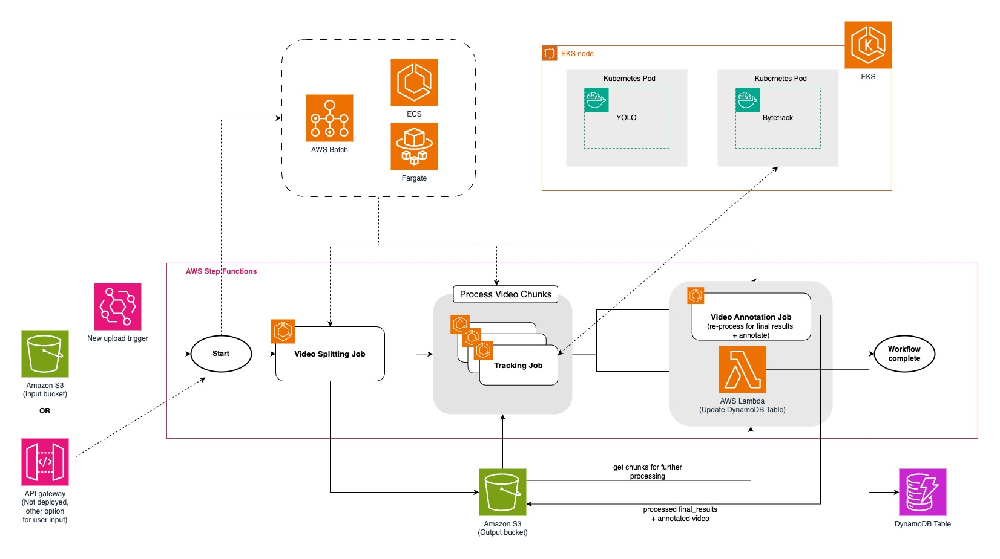

## Architecture

Deploys a stack that uses services as shown to process long videos with parallel processing

Describing what each sub-stack's role:
- Main video processing (Step Function orchestration / Batch jobs / post-processing): `processing-stack.ts`
- VLM hosting / inferencing: `eks-stack.ts`
- Input/output buckets: `storage-stack.ts`
- Rest of supporting infrastructure: `video-processing-stack.ts`, `ecr-stack.ts`, `network-stack.ts`, `iam-stack.ts`

Note:
- sample processing with yolov8 detectable objects with https://docs.ultralytics.com/datasets/detect/coco/#dataset-yaml 
- yolo and bytetrack settings refer to / customizable at `app/yolo/yolov8_service.py` and `app/bytetrack/bytetrack_service.py` respectively

## Deploy

`cd parallel-processing`

ensure you assume into aws account that you want to deploy the stack to

`export AWS_DEFAULT_REGION={preferred-aws-region}`

(if haven't) `cdk bootstrap`

`cdk deploy --all --require-approval never`